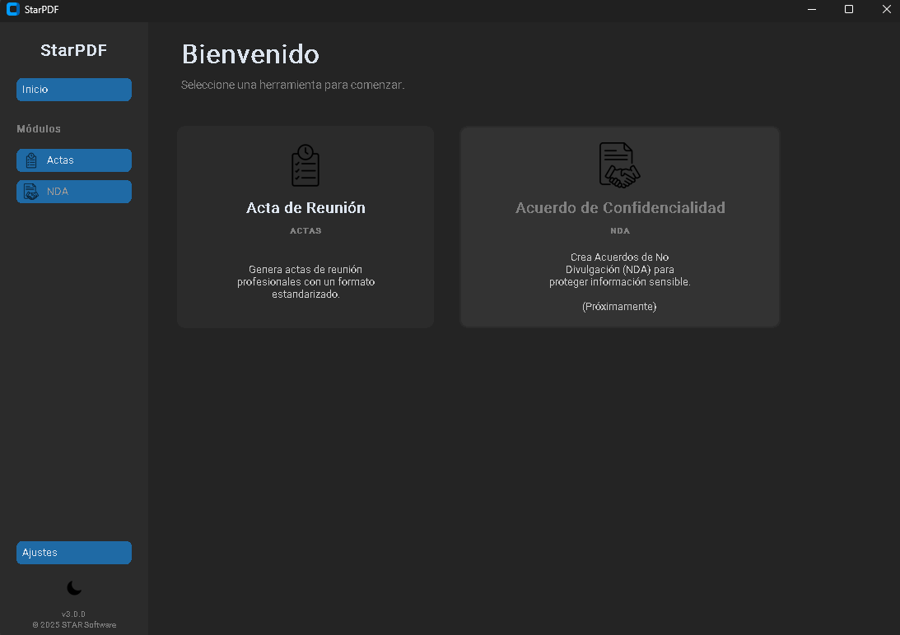

# StarPDF - Plataforma Profesional de Documentación v3.0.3

_Una aplicación de escritorio modular y elegante para generar documentos corporativos de alta calidad, desde Actas de Reunión hasta Acuerdos de Confidencialidad, todo desde una única interfaz intuitiva. Desarrollada por STAR Software._


---



## 📖 Sobre el Proyecto

**StarPDF v3.0** representa una evolución fundamental, transformándose de un simple generador de actas a una potente **plataforma de documentación modular**. Esta solución de software propietaria, desarrollada por **STAR Software**, está diseñada para centralizar y estandarizar la creación de múltiples tipos de documentos en un entorno corporativo.

Construida sobre una robusta arquitectura modular, StarPDF permite añadir nuevos generadores de documentos (como contratos, informes, etc.) con facilidad, manteniendo una experiencia de usuario consistente y profesional en toda la aplicación.

## ✨ Características Principales

- **Plataforma Multi-Documento:** Lanza diferentes generadores de documentos (Actas, NDAs, y más) desde un elegante dashboard de bienvenida.
- **Navegación Global:** Una barra lateral persistente permite cambiar fluidamente entre el inicio, los módulos y los ajustes.
- **Edición Dinámica con Drag & Drop:** Añade, edita, elimina y **reordena** items en las listas arrastrando y soltando, con una animación profesional en tiempo real.
- **Interfaz Moderna y Adaptativa:** Construida con CustomTkinter, incluye temas claro/oscuro con una suave animación de transición activada por un botón de icono.
- **Widgets Avanzados:** Utiliza selectores de fecha con calendario y selectores de hora para una entrada de datos rápida y precisa.
- **Alta Personalización:** Gestiona listas predefinidas de proyectos, lugares y personas desde una pestaña de "Ajustes" dedicada. Los cambios se guardan permanentemente.
- **Persistencia de Sesiones:** Guarda tu trabajo en un archivo `.json` y cárgalo más tarde para continuar donde lo dejaste.
- **Generación de PDF Profesional:** Exporta documentos con un diseño corporativo que incluye encabezado, pie de página y logo de la empresa.
- **Gestión Inteligente de Archivos:** Las configuraciones de usuario y los logs se guardan de forma segura en las carpetas de usuario apropiadas (`Documentos` y `AppData`), no en el directorio de instalación.

## 🛠️ Tecnologías Utilizadas

- **Python 3.9+**
- **CustomTkinter:** Para la interfaz gráfica moderna.
- **FPDF2 (fpdf):** Para la generación de documentos PDF.
- **PyYAML:** Para la gestión de archivos de configuración `.yaml`.
- **tkcalendar:** Para el widget de calendario emergente.
- **Pillow (PIL):** Para el manejo de imágenes (iconos, logo).
- **PyInstaller:** Para el empaquetado en un ejecutable `.exe`.

## 🚀 Instalación y Uso

**Para Usuarios Finales (Instalador):**

1.  Descarga la última versión del instalador proporcionado por STAR Software.
2.  Ejecuta el archivo `StarPDF_v3.0.2_Setup.exe`.
3.  Sigue las instrucciones del instalador. La aplicación se iniciará automáticamente al finalizar.

**Para Desarrolladores (Acceso Interno):**

El acceso al código fuente está restringido al personal de desarrollo de STAR Software. Si eres un desarrollador autorizado, sigue estos pasos:

1.  **Clona el repositorio interno:**

    ```bash
    git clone <URL_DEL_REPOSITORIO_INTERNO>
    cd starpdf
    ```

2.  **Crea y activa un entorno virtual:**

    ```bash
    # Crea el entorno
    python -m venv venv

    # Actívalo (Windows)
    .\venv\Scripts\Activate.ps1

    # Actívalo (macOS/Linux)
    source venv/bin/activate
    ```

3.  **Instala las dependencias:**

    ```bash
    pip install -r requirements.txt
    ```

4.  **Ejecuta la aplicación:**
    ```bash
    python -m src.main
    ```

## ⚙️ Configuración

La aplicación utiliza dos archivos `config.yaml` para una gestión flexible:

1.  **Plantilla Base (`config.yaml`):** Ubicado en la raíz del proyecto. Contiene la configuración por defecto y sirve como plantilla.
2.  **Configuración de Usuario:** Se crea automáticamente en la carpeta `Documentos/StarPDF` del usuario. **Este es el archivo que se modifica** para que los ajustes personales se guarden permanentemente.

## 📦 Creando el Ejecutable (.exe)

Para distribuir la aplicación como un único archivo ejecutable para Windows, se utiliza `PyInstaller`.

1.  **Instala PyInstaller:**

    ```bash
    pip install pyinstaller
    ```

2.  **Usa el script `run.py` como punto de entrada** y ejecuta el comando de compilación desde la raíz del proyecto:

    ```bash
    pyinstaller --name "StarPDF" --onefile --windowed --icon="assets/app_icon.ico" --add-data "assets;assets" --add-data "config.yaml;." run.py
    ```

    - `--onefile`: Crea un único archivo `.exe`.
    - `--windowed`: Evita que se abra una consola al ejecutar la app.
    - `--icon`: Asigna el icono al ejecutable.
    - `--add-data`: Empaqueta los recursos necesarios (`assets`, `config.yaml`) junto al `.exe`.

3.  El ejecutable final se encontrará en la carpeta `dist/`.

## 📜 Licencia y Derechos de Autor

**Copyright © 2024 STAR Software. Todos los derechos reservados.**

Este software es un producto propietario y confidencial de STAR Software. No está permitido copiar, modificar, distribuir, vender o realizar ingeniería inversa de este software sin el permiso explícito por escrito de STAR Software.

El uso de esta aplicación está sujeto a los términos y condiciones del Acuerdo de Licencia de Usuario Final (EULA) proporcionado con el software.
